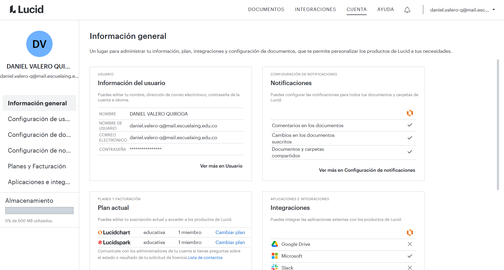
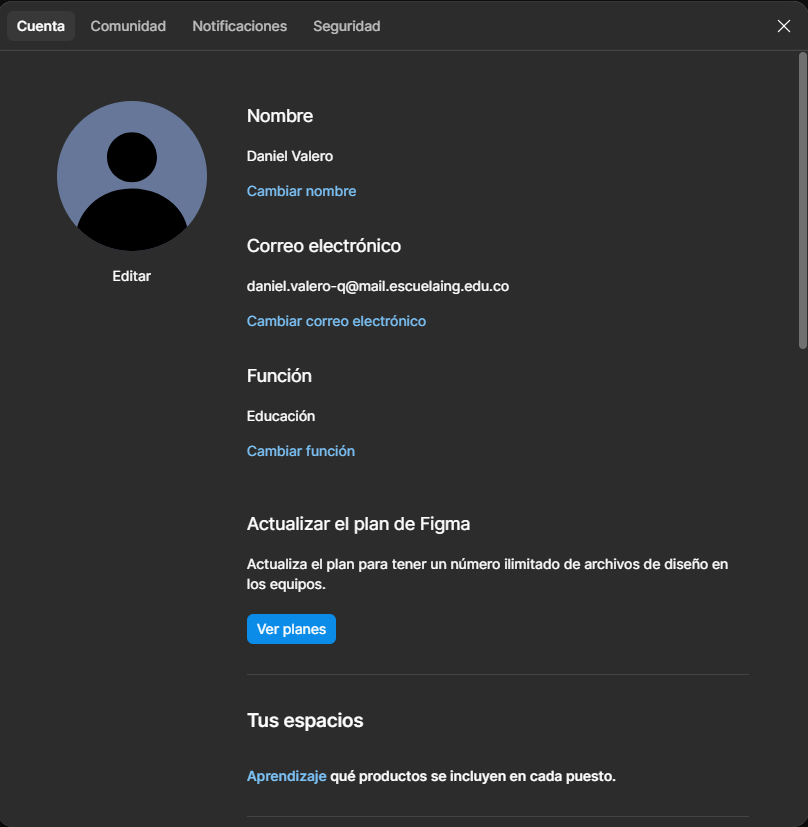
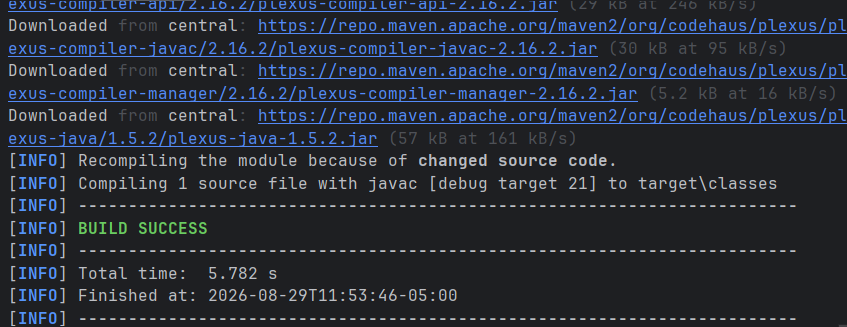
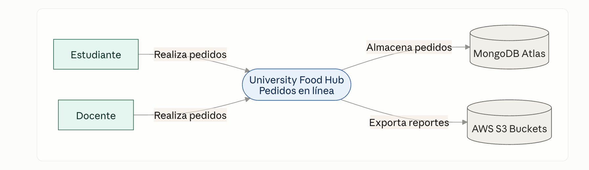
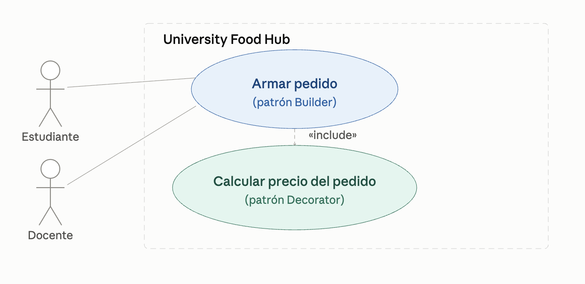

# DOSW - Parcial Práctico Primer Tercio

## Información del estudiante

- **Nombre:** Daniel Valero
- **Grupo:** [ESCRIBIR GRUPO DE DOSW]
- **Enunciado:** [Se completará durante el parcial]

---

## Herramientas

### Herramienta de modelado

Herramienta seleccionada: **[Lucidchart / Draw.io / Miro]**



### Figma

Evidencia de acceso a Figma:



---

## Proyecto Maven

El proyecto Maven fue configurado con:

- **groupId:** `edu.dosw.parcial`
- **artifactId:** `DOSW-ParcialT1`

### Evidencia de ejecución



---

## Estructura del proyecto

```text
.
├── pom.xml
├── src/
│   ├── main/
│   │   └── java/
│   │       └── edu/dosw/parcial/
│   └── test/
│       └── java/
│           └── edu/dosw/parcial/
├── docs/
│   ├── uml/
│   ├── images/
│   └── requirements/
├── .gitignore
└── README.md

```


## PUNTO 1
Diagrama de contexto:



## PUNTO 2
5 REQUERIMIENTOS DEL SISTEMA: 3 FUNCIONALES Y 2 NO FUNCIONALES. 1 CON BUILDER Y 1 CON DECORATOR

-**FUNCIONALES:**

**1.** Un pedido puede contener hasta 5 productos diferentes. (BUILDER)

**2.** Cada producto base puede tener sus propios extras. (DECORATOR)

**3.** El precio minimo de un pedido es de $3.500

-**NO FUNCIONALES:**

**1.** El sistema debe responder en <= 1.5s para el 990% de las peticiones

**2.** Colores de la cafeteria: Azul (#1B3A5C) y Dorado (#C67A00)


## PUNTO 3

2 REQUERIMIENTOS FUNCIONALES MAS IMPORTANTES

Diagrama caso de uso

RF-01 — Armar pedido personalizado (patrón Builder):
El sistema debe permitir que el usuario (estudiante o docente) arme un pedido seleccionando un producto base, agregando una o más opciones de extras, y eligiendo un tipo de entrega, construyendo el pedido paso a paso mediante el patrón Builder.

RF-02 — Calcular precio final del pedido (patrón Decorator):
El sistema debe calcular y mostrar en tiempo real el precio final del pedido, sumando dinámicamente el costo de cada extra seleccionado sobre el precio base, usando el patrón Decorator.
Historias de usuario

RF-01: Como estudiante o docente, quiero armar mi pedido eligiendo un producto base, agregando extras y escogiendo el tipo de entrega paso a paso, para personalizar mi comida sin complicaciones.

RF-02: Como estudiante o docente, quiero ver el precio final de mi pedido actualizado en tiempo real a medida que agrego extras, para saber exactamente cuánto voy a pagar antes de confirmar.


## PUNTO 4
Punto 4 resuelto en la carpeta docs/requirements


## PUNTO 5

## Descomposición de tareas — RF-01 (Armar pedido personalizado)

**Épica:** Gestión de pedidos en University Food Hub

Todo lo relacionado con que un usuario pueda pedir comida en línea: armar el pedido, calcularle el precio y confirmarlo.

**Feature:** Armar pedido personalizado

El usuario arma su pedido eligiendo producto base, extras y tipo de entrega.

**Historia de usuario:**

Como estudiante o docente, quiero armar mi pedido eligiendo un producto base, agregando extras y escogiendo el tipo de entrega paso a paso, para personalizar mi comida sin complicaciones.

**Tareas:**
1. Crear la clase `Pedido` y la interfaz `PedidoBuilder`, con métodos para ir agregando el producto base, los extras y el tipo de entrega uno por uno.
2. Implementar el `ConcretePedidoBuilder`, que valide las reglas de negocio mientras arma el pedido (máximo 5 productos, `ENTREGA_SALON` solo en bloques A o B, etc.).
3. Crear el método o clase "director" que reciba lo que el usuario seleccionó y use el builder para construir el objeto `Pedido` final.
4. Hacer las pruebas unitarias del builder, verificando que los 3 escenarios de ejemplo del parcial arme bien el pedido.


## PUNTO 6
Patrones asignados

Patrón 1: Builder

**a. Nombre y tipo:Builder:** es un patrón creacional (se encarga de cómo se crean los objetos, no de su estructura ni de su comportamiento).

**b. Justificación en el contexto de University Food Hub:** Un pedido no es un objeto simple: tiene un producto base, puede tener de 0 a varios extras, y tiene que llevar sí o sí un tipo de entrega. Si tratáramos de crear el pedido con un solo constructor gigante (new Pedido(producto, extra1, extra2, extra3, entrega, bloque, salon...)), terminaríamos con un constructor eterno y feo de leer, y encima muy fácil de usar mal (¿en qué orden van los parámetros? ¿cuáles son opcionales?).
Con Builder, en cambio, uno va armando el pedido paso a paso: primero elijo el producto, después voy agregando los extras que quiera, y al final defino la entrega. Cada paso es un método aparte, así que queda mucho más claro y menos propenso a errores. Además el mismo "armador" (builder) me sirve para construir pedidos completamente distintos dependiendo de lo que el usuario vaya seleccionando.

**d. Principios SOLID que aplica:**

SRP (Responsabilidad única): el Builder solo se encarga de ir armando el pedido pieza por pieza. La clase Pedido no tiene que saber cómo se construye a sí misma, y el Builder no tiene que saber qué se hace con el pedido una vez armado. Cada clase hace una sola cosa.

OCP (Abierto/cerrado): si mañana la cafetería agrega un producto nuevo tipo "combo", puedo crear un builder nuevo para ese caso sin tener que tocar el código del builder que ya existe para los demás productos.

DIP (Inversión de dependencias): si el código que usa el builder trabaja contra una interfaz genérica (por ejemplo PedidoBuilder) y no contra una clase concreta, puedo cambiar la forma en que se construye el pedido por dentro sin romper nada de lo que ya está usando el builder.

**Patrón 2: Decorator**

**a. Nombre y tipo:Decorator:** es un patrón estructural (se encarga de cómo se combinan o "arman" objetos para formar estructuras más grandes).

**b. Justificación en el contexto de University Food Hub:** Cada extra (proteína, aguacate, pan integral, queso, bebida) le suma un costo al producto base, y en teoría cualquier combinación de extras es válida. Si intentara resolver esto con herencia — por ejemplo creando una clase SandwichConQuesoYAguacate, otra SandwichConProteina, otra EnsaladaConTodo, etc. — terminaría con una cantidad absurda de clases, una por cada combinación posible.
Con Decorator, cada extra es como una "envoltura" que se le pone al producto: cada envoltura le suma su precio (y podría sumarle también su propio texto en el resumen del pedido) sin necesidad de tocar la clase del producto original. Así puedo combinar los extras que quiera, en cualquier cantidad y en cualquier orden, sin explotar en clases nuevas.

**d. Principios SOLID que aplica:**

OCP (Abierto/cerrado): si la cafetería agrega un extra nuevo (por ejemplo "salsa picante"), solo creo un decorador nuevo para ese extra. No tengo que modificar ni el producto base ni los demás decoradores que ya existen.

SRP (Responsabilidad única): cada decorador tiene una única responsabilidad: agregar su extra y su costo correspondiente. No hace nada más.

LSP (Sustitución de Liskov): como todos los decoradores implementan la misma interfaz que el producto base (por ejemplo Producto), en cualquier parte del código donde se espera un Producto puedo pasar un producto decorado y todo sigue funcionando igual — el sistema no distingue si es un producto "puro" o uno con cinco extras encima.


# DOSW_Parcial_T1_DanielValero
https://github.com/DanielValero09/DOSW_BITACORA.git
# DOSW_Parcial_T1_DanielValero
https://github.com/DanielValero09/DOSW_BITACORA.git
